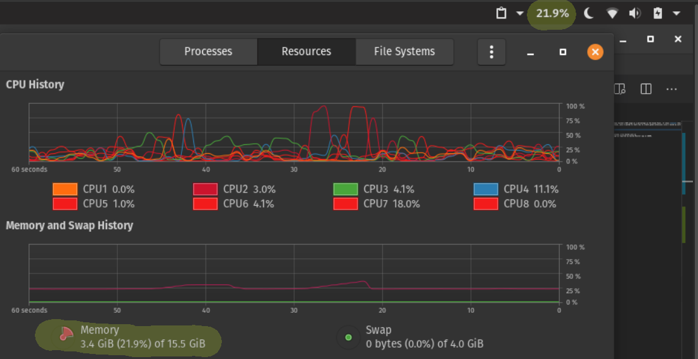

## Usage and Installation
1. You'll need GNOME Tweaks to toggle the usage of the extension
2. Gnome with at least version 3
3. Download and extract the extension to `~/.local/share/gnome-shell/extensions/`.
4. Per Gnome specifications, it's required that the extension folder be the same name as the `uuid` in `metadata.json`. 
5. Once that's done, run `gnome-extensions enable ram-usage@olumidesan.me`. 
6. Open Gnome Tweaks and enable the extension in the `Extensions` tab.
7. Restart your system. That's on Gnome, not me.

## Misc
- Should work on any GNOME3 version. I've tested just on version 3.34, PopOS! 19.10.
- Designed to show the RAM usage as reported by System Monitor app on GNOME.

## Screenshot

